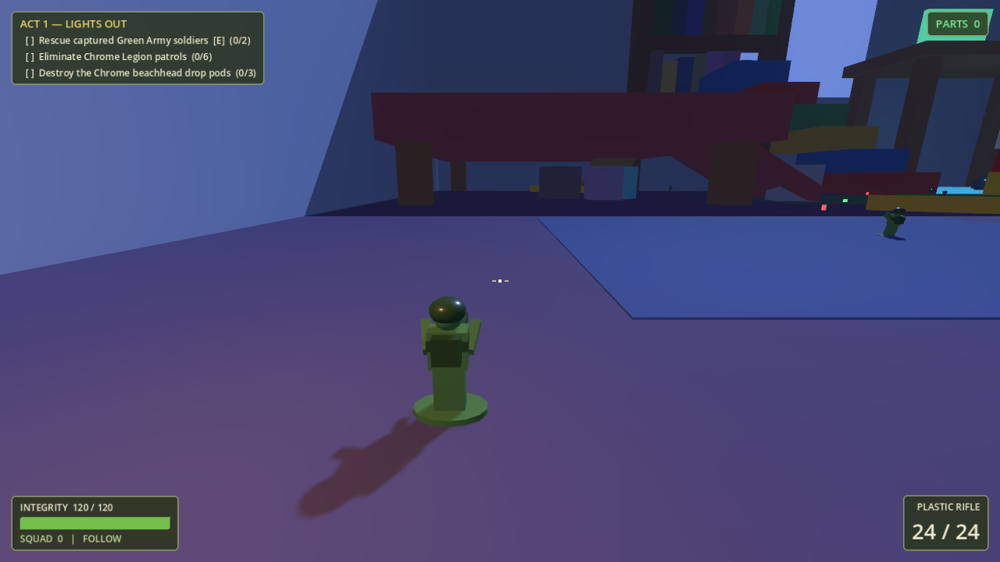

# THE TRENCHES

*When the lights go out, the war begins.*

A cinematic 3D toy-soldier open-world action adventure built in **Godot 4.3**. You are a
miniature Green Army soldier in a child's bedroom the size of a continent. The Chrome
Legion has landed, and the carpet plains are a battlefield.



## Running the game

1. Install [Godot 4.3+](https://godotengine.org/download) (standard build, no .NET needed).
2. Open this folder as a project and press **F5**, or from a terminal:

```bash
godot --path .
```

A headless CI smoke test is built in:

```bash
godot --path . -- --smoketest
```

## Controls

| Input | Action |
|---|---|
| WASD | Move |
| Mouse | Camera / aim |
| Left click | Fire |
| Right click | Aim-down-sights zoom |
| Shift | Sprint |
| Space | Jump |
| R | Reload |
| E | Interact: rescue prisoners, enter/exit the tank |
| 1 / 2 / 3 | Squad orders: Follow / Hold / Charge |
| Esc | Pause |

## What's playable right now (Phases 1–4 of the roadmap)

- **Third-person soldier** with over-the-shoulder camera, sprint, jump, ADS zoom,
  camera shake, waddle animation (toy soldiers have no knees), plastic-shard deaths.
- **Act 1, Mission 1 — "Lights Out"** (The Bedroom): rescue 2 captured soldiers,
  eliminate 6 Chrome patrols, destroy the 3-pod Chrome beachhead. Destroying the
  first pod triggers a reinforcement counterattack.
- **Act 1, Mission 2 — "Rug Burn"** (The Living Room): rescue the pinned squad,
  destroy the Chrome outposts... and survive what wakes up in the closet.
- **Act 1, Mission 3 — "Counter Strike"** (The Kitchen): checkerboard-tile arena
  with the table mesa, the counter ridge (climb the open drawers), the fridge
  monolith and a Chrome supply depot dug into a cereal-box fort.
- **Act 2, Mission 1 — "Tub Thumping"** (The Bathroom): a porcelain war — the tub
  canyon fortress (with resident rubber duck), the toilet watchtower, towel-ramp
  climbs, and a Chrome listening post hidden in the under-sink crawlspace.
- **Act 2, Mission 2 — "Motor Pool"** (The Garage): fight beneath THE CAR between
  tire towers, climb the paint-can shelf cliffs and the workbench mesa, and crack
  the Chrome armor depot. Two Green Army tanks spawn here.
- **Act 2, Mission 3 — "No Man's Lawn"** (The Backyard): the open-sky finale.
  Moonlit grass plains, molehill foxholes, the sandbox desert theater, a flowerbed
  jungle with fireflies, the great oak, and a Chrome trench network guarding their
  field HQ — with counterattack waves pouring through the fence hole.
- **Enemy variations**: troopers, fast fragile scouts, shotgun heavies with double
  health, and long-range snipers — mixed into every patrol.
- **BOSS: THE VACUUM** — an armored household leviathan. Bullets spark off its
  purple canister; the three glowing filter pods on its back are the only weak
  points. Three phases: rug sweeps with a suction cone that drags you toward the
  intake, active hunting, and enraged wall-cracking charges. Get swallowed and it
  chews you and spits you out the exhaust.
- **The Living Room battlefield**: couch mountain range with cushion canyons and
  armrest towers, the coffee table plateau (with coaster helipad), the glowing TV
  command center and entertainment cabinet, juice-cup and crayon cover across the
  great rug, and a slipper bunker where your squad is pinned down.
- **The Bedroom battlefield**: carpet plains with rug landmarks, the bed fortress
  (climbable blanket ramp, pillow mountains, under-bed tunnels), desk command center
  with a book staircase, bookshelf cliffs, a LEGO city built from studded bricks,
  the toy chest bunker, scattered alphabet blocks / pencils / a giant bouncy ball
  for cover. Night lighting: moonlight through the window, a warm nightlight at spawn,
  cold Chrome glow over the enemy camp.
- **Enemy AI** (Chrome Legion): patrol routes, line-of-sight target acquisition,
  4 Hz decision ticks, strafing combat with range keeping, distance-based aim error,
  alerting nearby squads, chasing last-known positions, retaliating when shot from
  stealth. Pathfinding over a runtime-baked navmesh.
- **Squad system**: rescuable squadmates who join you and obey Follow / Hold / Charge,
  pick their own targets, and hold formation offsets.
- **Drivable toy tank**: hull steering, camera-tracked turret, explosive spring-loaded
  cannon with splash damage, recoil shove, engine sounds, mount prompt.
- **Drivable paper airplane**: arcade flight with banking turns, throttle, stall-speed
  glide, wing-mounted dart pods, crash damage, and bail-out with inherited momentum.
  Parked on the coffee table coaster — take off from the plateau edge.
- **Weapons as data**: plastic rifle, rubber band repeater, marble cannon (explosive),
  Nerf scattergun (5 pellets), chrome pulse blaster, tank cannon — all `.tres` files.
- **Six factions as data**: Green Army, Chrome Legion, Brick Kingdom, Wind-Up Empire,
  Plush Alliance, RC Syndicate — colors and stat multipliers drive unit generation.
- **Collection & economy**: plastic-part currency from kills and pods, health/ammo
  pickups, 5 named lost toys hidden in hard-to-reach places.
- **Toy-military HUD**: integrity bar, ammo, squad status, mission tracker, hit
  markers, damage vignette, notification feed, parts counter. Main menu, pause,
  victory and defeat screens.
- **Procedural audio**: every sound (plastic shots, rubber-band twangs, explosions,
  objective jingles) is synthesized PCM at startup — zero audio assets required.

## Architecture

```
autoload/            Global singletons
  Events.gd          Signal bus — all cross-system communication (multiplayer-ready)
  Game.gd            Game state, input map registration, squad roster, currency
  Missions.gd        Objective tracking; levels push objectives, gameplay reports progress
  Sfx.gd             Procedural PCM sound synthesizer + player pools
data/
  factions/*.tres    FactionData resources (colors, stat multipliers)
  weapons/*.tres     WeaponData resources (damage, fire rate, pellets, splash...)
scripts/
  data/              Resource class definitions (WeaponData, FactionData)
  combat/            Health component, Weapon, swept-raycast Projectile
  units/             Unit base class → Player, EnemySoldier, SquadMate; ToyBodyBuilder
  vehicles/          ToyTank (turret template), PaperPlane (aircraft template)
  rooms/             RoomBase → Bedroom, LivingRoom, Kitchen, Bathroom, Garage, Backyard
  world/             Pickup, LostToy collectible, DropPod destructible objective
  ui/                HUD (built in code, toy-military styling)
  util/              ToyMaterials (plastic/metal/soft/glow factory), Fx (one-shot particles)
  Main.gd            Flow: menu → mission → victory/defeat; pause; smoke test
```

Design rules the codebase follows:

- **Composition over inheritance**: anything damageable owns a `Health` node; anything
  that shoots owns a `Weapon` node fed by a `WeaponData` resource. Pods, tanks and
  soldiers share the same combat pipeline.
- **Data-driven**: new weapons and factions are `.tres` files, no code.
- **Decoupled via the signal bus**: UI never references gameplay nodes directly.
- **Swappable art**: characters, guns and the tank are real asset-pack models loaded
  through `ModelLib` (with `ToyBodyBuilder` primitives as automatic fallback if a file
  is missing); attachment points (`WeaponMount`) stay identical either way.
- **Performance**: CPU particles, cached materials, 4 Hz AI thinking with staggered
  ticks, hitscan-swept projectiles — scales down to mobile.

## Roadmap (the master plan)

| Phase | Content | Status |
|---|---|---|
| 1 | Soldier, movement, camera, shooting | ✅ |
| 2 | Bedroom battlefield | ✅ |
| 3 | Enemies and squads | ✅ |
| 4 | Vehicles | ✅ tank + paper plane |
| 5 | Mission system | ✅ mission select + campaign advance |
| 6 | More rooms | ✅ living room · kitchen · bathroom · garage · backyard |
| 7 | Story campaign & bosses | ✅ The Vacuum · Cat/Roomba/Moving Day designed |

How to extend:

- **New room**: subclass `RoomBase`, build landmarks with `_static_box`, spawn units,
  push objectives, then register it in the `MISSIONS` dictionary in `Main.gd` — the
  menu and campaign-advance flow pick it up automatically.
- **New faction unit**: new `FactionData` .tres + optionally a `Unit` subclass.
- **New vehicle**: follow `ToyTank.gd` (ground) or `PaperPlane.gd` (air) — mount
  check, drive loop, a `Weapon` node on a pivot.
- **New boss**: follow `VacuumBoss.gd` — an armored body with separate weak-point
  colliders that own `Health` components, plus phase escalation on each kill.

## Asset credits

3D models in `assets/models/` come via [Poly Pizza](https://poly.pizza):

- **[Quaternius](https://quaternius.com)** (CC0): characters and guns from the
  *Toon Shooter Game Kit*, tank, desk, chair, bookcase, fridge, sports car,
  washing machine, bathroom sink, environment props.
- **[Kenney](https://kenney.nl)** (CC0): double bed, coffee table, bathtub.
- **CMHT Oculus** (CC-BY): dining table. **jeremy** (CC-BY): TV.
  **Pat Siefring** (CC-BY): toilet. **MilkAndBanana** (CC0): stove.
  **Poly by Google** (CC-BY): Roomba (the Vacuum boss).

Fonts: *Black Ops One* and *Russo One* (Google Fonts, OFL).
